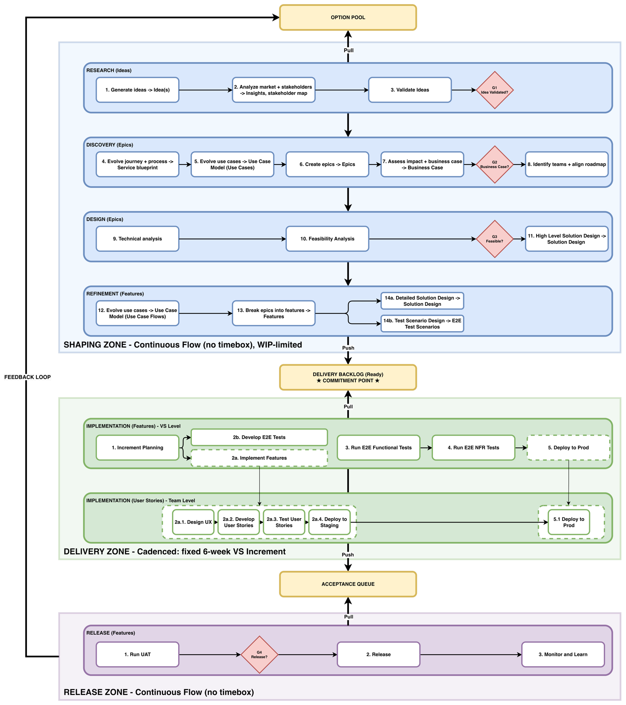

# 4. Operating Model

Work flows through three zones connected by two buffers. The Shaping Zone runs as continuous flow; the Delivery Zone runs on the 6-week cadence; the Release Zone (acceptance and release) returns to continuous flow. The Delivery Backlog joins the first pair; the Acceptance Queue joins the second. “Track” and “zone” are used interchangeably. Tracks name the boards and their governance, and zones name the regions of the consolidated process picture. There is a key asymmetry at the commitment point. Before it, discarding work costs nothing and is encouraged; after it, discarding has a real cost, because capacity has already been negotiated. The Option Pool holds options and the Delivery Backlog holds commitments. An option keeps its value by being exercised late, with the best available information, or dropped at no cost.

| Element | Nature | Purpose |
| --- | --- | --- |
| Option Pool (Shaping Backlog) | Uncommitted pool of options | Ideas and epic candidates prior to validation. Anyone may contribute; Monitor and Learn insights land here. Kill decisions are free. Pruned periodically by VSO/VSAL. |
| Shaping Zone | Continuous flow, WIP-limited, no timebox | Matures ideas into Definition-of-Ready features through Research, Discovery, Design, and Refinement, governed by three Go/No-Go gates. |
| Delivery Backlog (Ready) | Buffer (the commitment point) | Holds only DoR-complete features. Entering it is the organization’s commitment to build. |
| Delivery Zone | Cadenced: fixed 6-week VS Increment | Teams pull features, implement and test in their own environments, develop and run the VS-level E2E functional and NFR tests in staging, and deploy the verified increment to production. |
| Acceptance Queue | Buffer (the delivered line) | Holds features that are E2E-verified and deployed dark to production, awaiting business pull. Entering it is the definition of Delivered. |
| Release Zone (Acceptance & Release) | Continuous flow, no timebox | Business judges the work and decides when to expose it. UAT runs per feature, at any time, against the hidden version in production, followed by the release decision (G4). |

Buffer health is the primary system metric. If the Delivery Backlog falls below one increment’s demand, Shaping is the constraint; if it exceeds two increments’ demand, Shaping pauses and the stream concentrates on delivery. Invisible queues are a large and rarely measured source of waste in product development (Reinertsen), so the design keeps its main queue visible and bounded.

*Figure 1. The consolidated process: three zones, two buffers, four gates, and the closed feedback loop.*

## 4.1 Cadence Structure

The VS Increment is fixed at six weeks and contains the team sprints (three 2-week or two 3-week sprints). Teams do not commit a batch of scope to the increment. The increment boundary is the point where the value stream synchronizes; the increment itself is not a six-week sprint. A regular cadence lowers the cost of coordination without forcing work into batches.

Deployment is a technical event carried out by the teams. The Delivery Zone ends with the increment deployed to production but receiving no traffic (dark launch). Release is a business decision that turns on exposure of the new features, and it takes place in the Release Zone. Teams choose how to achieve a hidden deployment; this playbook does not prescribe it. The isolation itself is mandatory: hidden features must not affect live users or data. This is an entry condition for the Release Zone.

## 4.2 Two flight levels

The board system has two levels by design, following Leopold’s Flight Levels model. The VS board works at the coordination level (Flight Level 2) and holds epics and features, while team boards work at the operational level (Flight Level 1) and hold stories. Coordination runs across teams without reaching inside them. The value stream sees its share of each team’s work through the value-stream tag, and team internals stay under team control. A feature may span several teams (the business team and the enablers contributing stories), and its state is derived from every contributing board.

## 4.3 The rhythm: flow, cadence, flow

The six-week cadence governs only the start of the increment, when planning pulls features. Nothing else is tied to the clock. Acceptance is continuous flow: a stakeholder pulls a Delivered feature from the Acceptance Queue and accepts it at any time. By default, release is on demand, so an accepted feature that is already deployed and hidden can be exposed as soon as the VSO decides.

Events with a high coordination cost belong on a cadence, while cheap events can flow (Reinertsen’s transaction-cost principle). Where exposing features carries a high coordination cost, such as operational readiness, support preparation, communications, or features from several teams that only make sense together, a stream may align G4 with the increment boundary and run a release train. Accepted features then wait for the next scheduled release. Where strong isolation of hidden features and solid operational readiness have lowered that cost, features are released one by one, following the principle “develop on cadence, release on demand.” Each stream sets its own release rhythm and should move it toward cheaper and more frequent releases over time.
