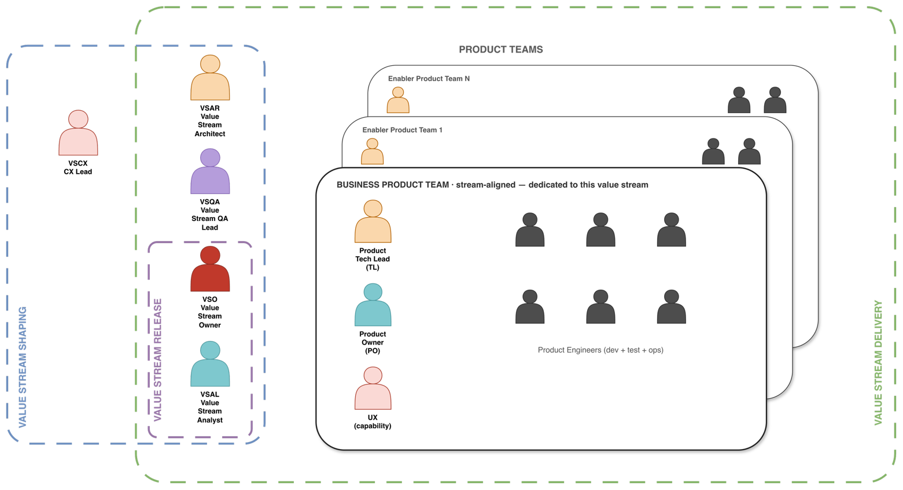

# 5. Roles and Team Topology

## 5.1 Value Stream Roles (a role layer, not a team)

| Role | Description | Primary playbook touchpoints |
| --- | --- | --- |
| VSO | Value Stream Owner. ROI and market strategy of the stream, commercial prioritization | Gates G1 and G2; increment goal; release decision |
| VSAL | Value Stream Analysis Lead. Translation of vision and journey into processes, use cases, and epics | Discovery and Refinement stages |
| VSAR | Value Stream Architect. Macro system design and enterprise feasibility | Design stage; Solution Design; gate G3; ADRs |
| VSCX | Value Stream Customer Experience Lead. End-to-end customer journey and interaction design (low-fidelity UX) | Service blueprint; low-fi UX concepts in Refinement |
| VSQA | Value Stream QA Lead. Macro integration quality and cross-system verification | E2E test scenario design in Refinement; E2E Verification; owns the E2E suites |

## 5.2 Product Team Roles

| Role | Owns | Macro counterpart |
| --- | --- | --- |
| PO | Product Owner. Sprint ROI, story prioritization, and arbitration of multi-stream demand on the team | VSO |
| TL | Technical Lead. Micro-architecture, code quality, technical execution | VSAR |
| PE | Product Engineer. Code, unit/component tests, local automation, and running their product in production (build-run) | None |
| UX (capability) | User Experience Lead. Detailed UI design within the team | VSCX |

## 5.3 Topology: one dedicated stream-aligned team, N shared enabler teams

A value stream comprises one business product team and multiple enabler product teams. The business product team is stream-aligned and dedicated: it exists for this stream, and its full capacity serves it. The enabler teams are platform teams in the Team Topologies sense. They are shared deliberately, because they own core IT products that serve many streams at once. Duplicating those capabilities for each stream would be waste, and assigning them to a single stream would deny them to the others. The rules below manage the dependency that sharing creates.

- **Capacity allocation:** Streams receive a capacity share committed by the PO (for example, 40% of the next sprint); the team itself is never assigned to a stream. The PO is the single arbitration point. VSOs negotiate with POs and do not task teams directly.

- **The shared roadmap is a capacity agreement:** It records the agreement and gates entry to the Design stage. No epic proceeds without capacity.

- **Team internals stay with the team:** The value stream does not set a team’s method, internal cadence, ceremonies, or board layout.

*Figure 2. Team topology.*
