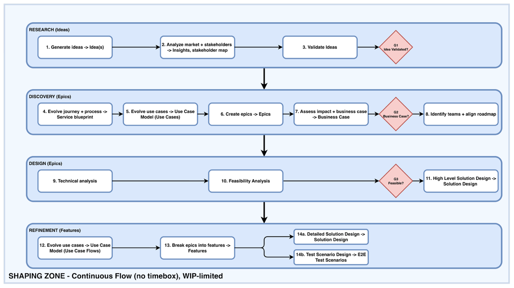
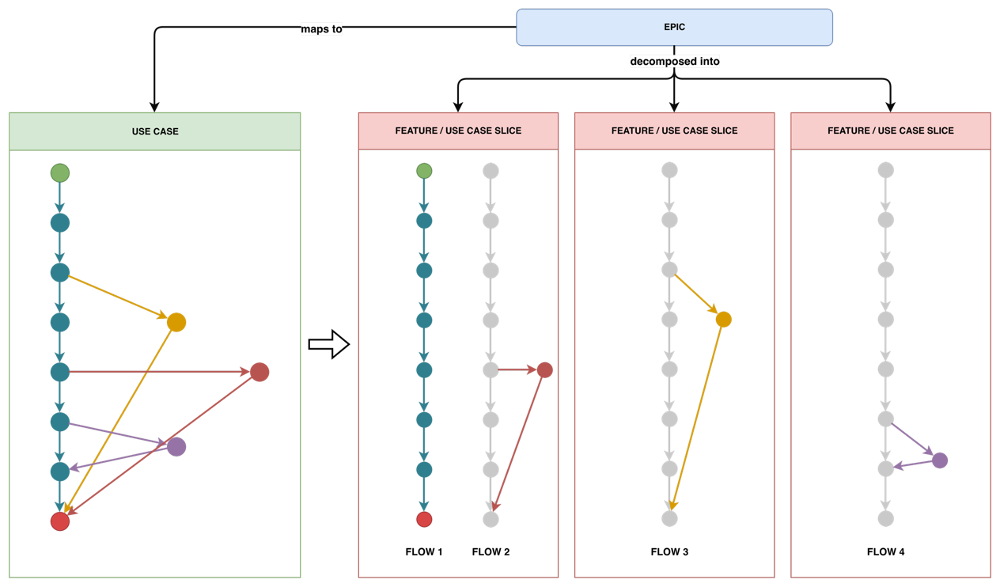

# 6. Shaping Track

Continuous flow across four WIP-limited stages. The size of the work item changes as the work matures: ideas in Research, epics in Discovery and Design, features in Refinement. The WIP limits below are starting points. Each one is tied to the scarcest role in its stage, meaning the person or capability that work waits on, so the limit protects the real bottleneck. The numbers should be adjusted based on how work actually flows. A stage pulls new work only when it is below its WIP limit and the item meets the entry criteria.

*Figure 3. Shaping Zone.*

| Stage | WIP | Activities | Key outputs |
| --- | --- | --- | --- |
| Research | 4 ideas | 1 Generate ideas 2 Analyze market + stakeholders 3 Validate ideas (G1) | Ideas, market insights, stakeholder map |
| Discovery | 3 epics | 4 Evolve journey + process 5 Evolve use cases 6 Create epics 7 Assess impact & business case (G2) 8 Identify teams & align roadmap | Service blueprint increment, use cases, epics, ROM estimate, shared roadmap (capacity agreement) |
| Design | 1 epic | 9 Technical analysis 10 Feasibility analysis (G3) 11 High-level Solution Design (architectural runway) | Feasibility sketch, Solution Design (per epic) |
| Refinement | 4 features | 12 Elaborate use case flows 13 Break epics into features 14a Detailed Solution Design 14b Test Scenario Design | Elaborated use case flows, features (= UC slices), detailed solution design, E2E test scenarios |

## 6.1 Activities

- **Research**

    1. **Generate ideas.** Capture candidate ideas into the Option Pool from any source: market signals, customer feedback, internal proposals, or the Monitor and Learn loop.

    2. **Analyze market + stakeholders.** Study the market context and identify everyone affected by or interested in the idea, producing early insights and a stakeholder map.

    3. **Validate ideas.** Test whether the idea is worth pursuing: whether the problem is real, whether there is demand, and whether it fits the value stream’s purpose. At G1, validated ideas become epic candidates and the rest are archived with a reason.

- **Discovery**

    4. **Evolve journey + process.** Update the customer journey and the supporting processes in the service blueprint, covering both the front-stage experience and the back-stage systems.

    5. **Evolve use cases.** Extend the use case model with the use cases the idea implies, at outline level. The flows are detailed later, in Refinement.

    6. **Create epics.** Turn the validated idea into one or more epics, the transient work items that each carry a macro unit of business value. An epic links to every use case it creates or changes.

    7. **Assess impact & business case.** Weigh the epic’s cost, value, and risk, and produce a business case that justifies the investment.

    8. **Identify teams & align roadmap.** Using the use cases, the blueprint, and the system landscape, map the touched capabilities to their owning teams, then agree a shared roadmap with those teams. The team list here is capability-based and provisional; it is confirmed later, at G3. At G2, an epic passes only when its business case holds and capacity has been agreed.

- **Design**

    9. **Technical analysis.** Investigate the solution space for the epic, including existing systems, constraints, and options, before choosing a direction. This can reveal teams that the use cases alone did not show.

    10. **Feasibility analysis.** Test the leading solution direction against a cheap sketch, to confirm it is workable before deeper design begins. G3 evaluates feasibility on this sketch and re-validates the provisional team list against it.

    11. **High-level Solution Design.** Produce the epic-level Solution Design: the target state, use case realization flows, the integration boundaries, and the impact on teams and contracts.

- **Refinement**

    12. **Elaborate use case flows.** Deepen the flows of the relevant use cases to testable precision, as a coherent, delivery-agnostic narrative, independent of how the work will be split for delivery.

    13. **Break epics into features.** Create features, each bundling one or more flows of one use case, and link them back to the model. Activities 12 and 13 are usually done together (see section 6.3).

    14. (a). **Detailed Solution Design.** Add the feature’s subsection to the epic’s Solution Design and draft the contract versions, covering component interfaces and integration points. Low-fidelity UX can also be worked out at this stage.

        (b). **Test Scenario Design.** Derive the E2E test scenarios from the feature’s bundled flows and write them into the use case model as the flows’ test payload. The input is the flows, not the output of 14a.

## 6.2 Design levels

The Design stage produces architectural runway. It settles only the decisions that must be made centrally, because their effects reach beyond one team and reversing them is expensive: shared contracts, integration boundaries, and cross-team constraints. Everything else is left to the teams. The Solution Design draws that line; it does not specify the whole design.

Design happens at three levels. Each level goes as deep as its question requires and leaves the rest to the level below.

- Level 1 is the Solution Design, per epic, produced in Design. It answers two questions: how does the system get from A to B, and which decisions bind multiple teams? It covers the one-way-door decisions only.

- Level 2 is detailed design, per feature, produced in Refinement. It answers one question: what must this feature do at its boundaries to meet the Definition of Ready? This covers the interfaces: the bundled use case flows worked out to testable precision, draft contract versions where the feature crosses team lines, the low-fi interaction concept, acceptance criteria, and E2E test scenarios.

- Level 3 is micro-design, per story, produced in Delivery. It answers one question: how do we build it? This level is team property, TL-owned, emergent, and never produced upstream; detailed UI design lives here.

## 6.3 The use case model

The Shaping Track is one continuous activity: evolving the use case model and creating work items to track the changes. The model is the master, and work items are transient trackers of changes to it. A new **use case** generates an epic. Below the use case, the unit of the model is the **use case flow**, a structural branch of behavior: the basic flow, an alternative flow, an exception flow, and so on. A use case consists of its flows, elaborated to testable precision as a coherent, delivery-agnostic narrative. The flows are permanent and stay in the model as the specification of that behavior for as long as the behavior exists. A **scenario** is one concrete traversal of flows with specific values. Scenarios are the flow’s test payload; they are neither a unit of the model nor a unit of slicing. Selecting flows is a scoping decision, and choosing the number of scenarios per flow is a coverage decision. The two should be kept separate.

The **feature** is the **use case slice** in Jacobson’s sense: a transient work item that bundles one or more flows of exactly one use case for delivery. It is created in Refinement, delivered within an increment, and discarded when done. The terms feature and slice are interchangeable in this playbook. A feature either introduces new flows or revises existing ones, and it may bundle several at once. Releasable value drives the bundle; there is no fixed one-flow-per-feature rule. The one-use-case rule is the default. A feature bundling flows from several use cases is a smell: either the flows belong together and the model is mis-factored, or the feature is really two features. Deviations are allowed only when flagged and justified. Epic to use case is many-to-many with a one-to-one tendency, and the epic links to every use case it creates or modifies. Enabler work is the named exception to traceability. Runway, tech debt, and compliance are not use-case-shaped, so they trace to their rationale (ADR, Solution Design, runway item) instead of to invented use cases.

*Figure 4. Slicing worked example: the use case’s flows on the left (color = flow identity); each feature bundles one or more flows, with the first slice taking the basic flow plus a critical exception and later slices delivering the rest.*

The model grows in breadth first, and content is kept separate from timing. Content does not depend on delivery: a flow describes what the service does, with no reference to how the work will be split. Timing does depend on delivery. Discovery identifies and outlines the use cases, which gives a cheap overview, and the flows are worked out to testable precision just in time in Refinement, as the features that will bundle them take shape. Writing full flow narratives long before they are needed creates inventory, in the same way as building runway too early.

Activities 12 and 13 are one decomposition act seen from two sides. Activity 12 is the model side, where flows are worked out, and activity 13 is the work-item side, where features bundle them. The same people usually do both in the same session. The process flow shows them in sequence to make clear that the model comes first.

Activities 14a and 14b run in parallel. In 14b, VSAL and VSQA take the flows elaborated in activity 12 and write their E2E test scenarios, the concrete traversals that will later be tested. These scenarios describe behavior only and carry no solution detail. In 14a, VSAR and VSCX work on the solution side: they add the feature’s subsection to the Solution Design, draft the contract versions, and sketch the low-fidelity UX. Because the scenarios come from the flows and not from the solution design, 14a never holds up 14b. Solution detail enters later, in Delivery, when the automated tests are bound to the running system.

Non-functional requirements attach at two levels. System-wide NFRs (performance, security, compliance baselines) are standing constraints on every flow, verified at two levels: teams test their own product’s NFRs in their own environments, and the VS-level E2E NFR suite verifies the integrated system in staging within each increment. Use-case-specific NFRs attach to their use case and are realized through the scenarios of its flows. Neither kind requires invented use cases.
