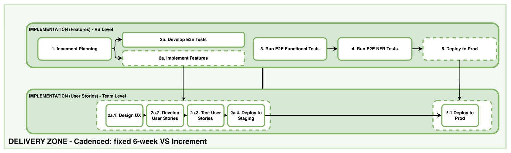
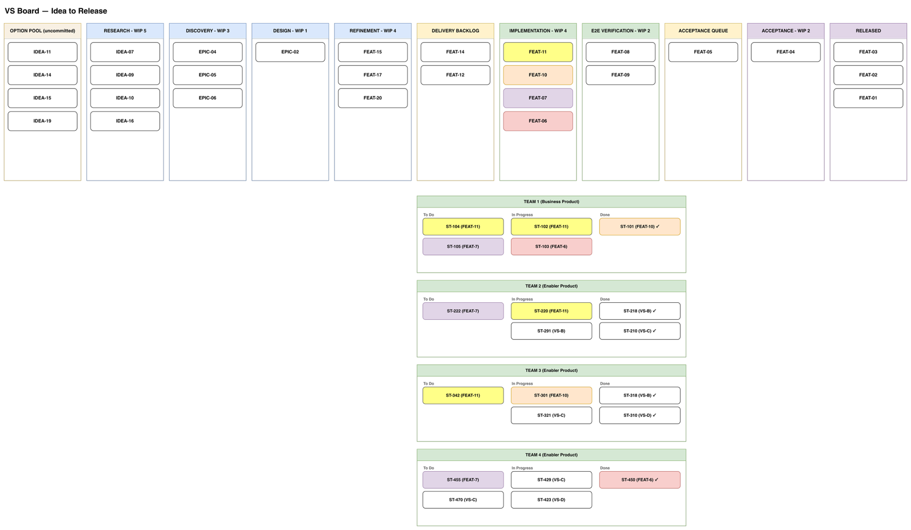

# 7. Delivery Track

Feature-level flow on the VS board, cadenced by the six-week increment. Features enter from the Delivery Backlog, the buffer that holds DoR-complete features at one to two times one increment’s demand. Stories exist only on team boards; a feature’s state on the VS board is derived from its child stories. The Delivery Zone covers activities 1 to 5 and ends with the increment deployed to production but hidden from users. The Release Zone follows as continuous flow, with its own activities 1 to 3.

*Figure 5. Delivery Zone.*

| Stage | Activities | Key outputs |
| --- | --- | --- |
| Increment Planning | 1 Increment Planning | Increment goal, team-level items on team backlogs |
| Implementation | 2a Implement features 2b Develop E2E automated tests | Working software on staging, E2E automated tests |
| E2E Verification (staging) | 3 Run E2E functional tests 4 Run E2E NFR tests | Verified increment in staging |
| Deploy to Production | 5 Deploy to production | Increment in production, hidden from users (Delivered) |
| Acceptance (Release Zone) | 1 Run UAT, per feature | Accepted features |
| Release (Release Zone) | 2 Release (G4) | Value exposed to customers |
| Monitor and Learn (Release Zone) | 3 Monitor and learn | Insights logged into the Option Pool |

There is no event at the increment boundary. Validation happens during acceptance and exposure is decided per feature, so the boundary only marks the end of one increment and the planning of the next.

*Figure 6. The VS board (Flight Level 2) over the team boards (Flight Level 1).*

## 7.1 Activities

- **Delivery Zone**

    1. **Increment Planning.** A VS-level coordination event at the start of each increment. VS roles, POs, and TLs set the increment goal and jointly decompose the pulled features into team-level items, so cross-team dependencies surface in the room. Teams then carry those items into their own backlogs and manage them as they see fit.

    2. **(a) Implement features.** Teams build the features they pulled, designing the detailed UI and developing and testing their own stories, including functional and NFR testing of their own product in their own environments. Work is deployed continuously to staging.

        **(b) Develop E2E automated tests.** The E2E test scenarios written into the use case flows during Refinement (14b) are developed here into executable automated tests: the test code, the fixtures, and the assertions that run them against the solution being built.

    3. **Run E2E functional tests.** VSQA runs the VS-level end-to-end functional suite against the integrated system in staging. This is the first point where the products of several teams are verified together.

    4. **Run E2E NFR tests.** The VS-level non-functional suite, covering performance, security, and compliance baselines, runs against the same staging environment within the increment. Formal periodic attestations such as penetration tests run per release or per quarter, not per feature.

    5. **Deploy to production.** Teams deploy the verified increment to production, hidden from users. At this point the feature enters the Acceptance Queue and counts as Delivered.

- **Release Zone**

    1. **Run UAT.** Business stakeholders pull each Delivered feature when they are ready and test it against hidden production. Acceptance is continuous flow and does not follow a schedule.

    2. **Release.** The VSO switches exposure on for an accepted feature. This changes visibility only; nothing is deployed. By default this happens on demand, per feature; a No-Go leaves the feature deployed but hidden.

    3. **Monitor and learn.** Once a feature is exposed, the stream observes how it performs and logs what it learns into the Option Pool as new ideas or journey updates, which feeds back into Research.
