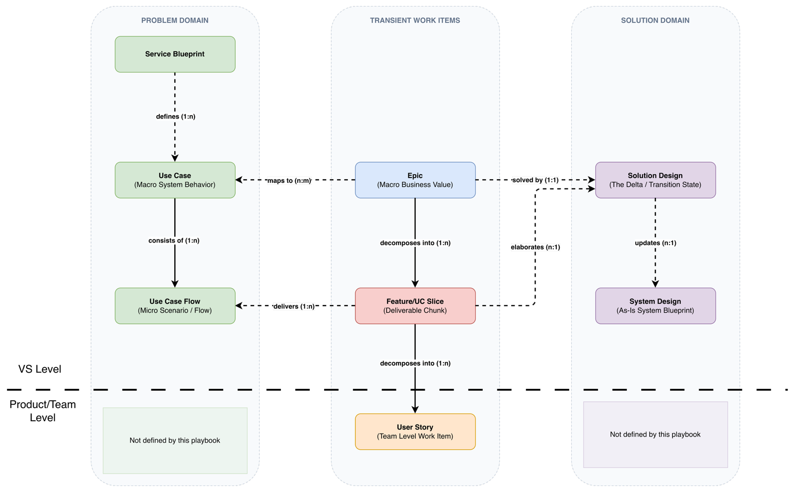

# 10. Documentation Model

Knowledge is permanent; work items and change documents are transient. “Transient” means change-scoped, not short-lived: a transient document describes one change and is retired when that change completes. Work items point at knowledge but do not contain it. The full relationship picture has three columns. The problem domain (service blueprint, use cases, flows) and the solution domain (Solution Design, System Design) sit on the outside, with transient work items in the middle pointing outward at both: an epic maps n:m to use cases and is solved 1:1 by a Solution Design; a feature delivers 1:n flows of one use case and elaborates the Solution Design n:1; and Solution Designs are absorbed n:1 into the System Design as-built. Below the VS level, team documentation is intentionally not defined by this playbook.

*Figure 7. Documentation architecture.*

Nobody should need to read archived Solution Designs to understand the system; if they do, the living documentation is out of date. Updating living documentation is part of the feature Definition of Done and should not be treated like a separate cleanup task.

## 10.1 The Solution Design lifecycle

One Solution Design per epic. An epic’s features are slices of one A→B transition: they share the same target state and the same contracts. Feature-level elaboration lands in the living artifacts (flow elaborations in the use case repository, draft contract versions in the contract repo), with the feature carrying links. The document is structured for progressive deepening: a stable epic-level core (target state, one-way doors) plus a subsection per feature, added at that feature’s Refinement.

The lifecycle across iterations: per feature, delivery updates the living documentation as-built for that slice of the change. The Solution Design does not shrink; it keeps describing the full A→B, and delivered sections may be marked as bookkeeping. Per epic, when the last feature lands, the living docs fully describe state B, and the Solution Design is archived. It is change-scoped: an epic that runs four increments has a Solution Design that lives four increments.

## 10.2 When each living artifact updates

The use case model and the service blueprint are Shaping’s own output, since refining them is the shaping work, so they are updated during Shaping, at the moment the work happens, and never wait for delivery. The system architecture updates as-built during Delivery, as part of the feature Definition of Done, never at design time, because documenting a design before it is built produces documentation that may never match the real system. API contracts may be drafted ahead as proposed versions, because versioning distinguishes a proposed contract from the live one; the proposed version goes live when its implementation releases.

## 10.3 Where test knowledge lives

There is no separate test document, because test knowledge is already covered by other artifacts. E2E test scenarios live in the use case model as the flows’ test payload. A flow at testable precision includes its scenarios, and a separate test-design document would split one specification into two versions that drift apart. Automated tests live as code in the repositories, versioned like contracts, and serve as executable documentation.
